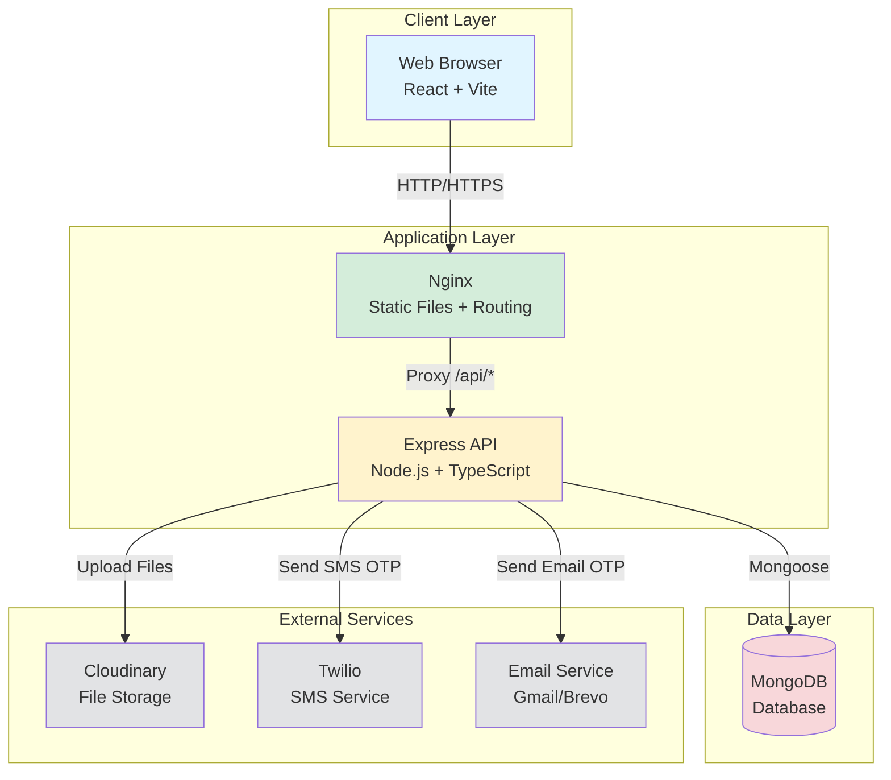
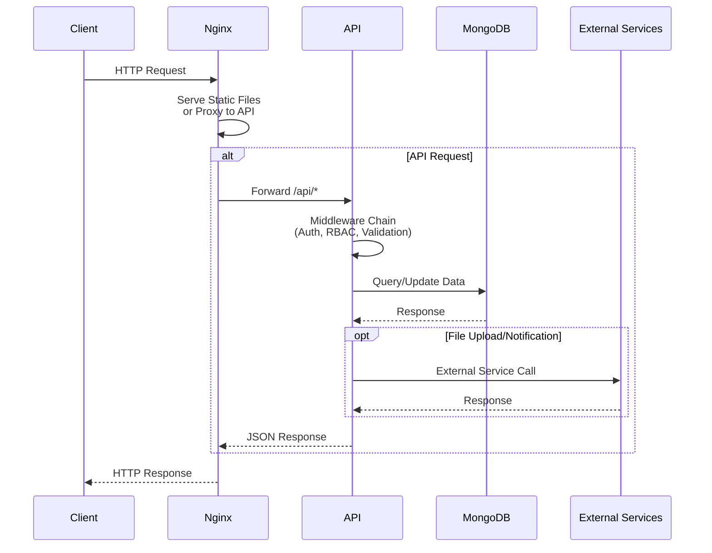
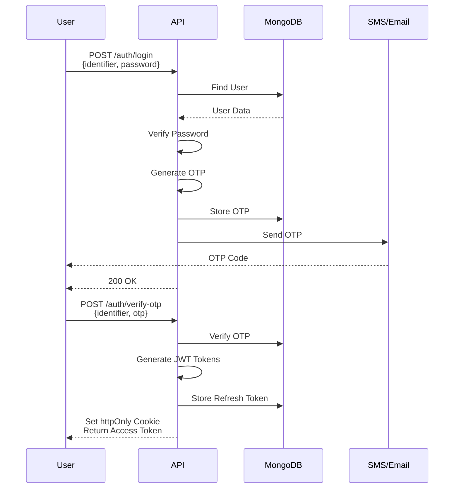

# Finance Dashboard — Backend

A production-grade financial management backend built with **Node.js, Express, MongoDB, and TypeScript**.  
Implements RBAC (3 roles), financial record CRUD, dashboard analytics, JWT auth with OTP 2FA, and soft-deletes.

---

## Table of Contents

- [Quick Start](#quick-start)
- [Environment Variables](#environment-variables)
- [Role Permissions](#role-permissions)
- [API Reference](#api-reference)
- [Bugs Fixed (v2)](#bugs-fixed-v2)
- [Architecture](#architecture)
- [Assumptions](#assumptions)

---

## Quick Start

```bash
# 1. Install dependencies
cd backend && npm install

# 2. Copy and fill in environment variables
cp .env.example .env

# 3. Seed the database (creates 3 users + 12 months of sample records)
npm run seed

# 4. Start dev server
npm run dev

# API available at:  http://localhost:5000
# Swagger docs at:   http://localhost:5000/api/docs
```

### Seed credentials (all share same password)

| Role    | Email               | Password   |
| ------- | ------------------- | ---------- |
| Admin   | admin@finance.dev   | Demo@12345 |
| Analyst | analyst@finance.dev | Demo@12345 |
| Viewer  | viewer@finance.dev  | Demo@12345 |

> Seed users skip OTP verification — use `POST /api/auth/login` then verify with test OTP `123456` (if `OTP_EMAIL_TEST_MODE=true`).

---

## Environment Variables

| Variable                                                                 | Required | Description                                   |
| ------------------------------------------------------------------------ | -------- | --------------------------------------------- |
| `MONGODB_URI`                                                            | ✅       | MongoDB connection string                     |
| `JWT_ACCESS_SECRET`                                                      | ✅       | Min 32 chars                                  |
| `JWT_REFRESH_SECRET`                                                     | ✅       | Min 32 chars, different from access secret    |
| `JWT_ACCESS_EXPIRES`                                                     | —        | Default `15m`                                 |
| `JWT_REFRESH_EXPIRES`                                                    | —        | Default `7d`                                  |
| `SMTP_HOST` / `SMTP_USER` / `SMTP_PASS`                                  | ✅       | For email OTP delivery                        |
| `TWILIO_ACCOUNT_SID` / `TWILIO_AUTH_TOKEN` / `TWILIO_PHONE_NUMBER`       | ✅       | For SMS OTP                                   |
| `OTP_EMAIL_TEST_MODE`                                                    | —        | `true` skips real email, uses `OTP_TEST_CODE` |
| `OTP_SMS_TEST_MODE`                                                      | —        | `true` skips real SMS, uses `OTP_TEST_CODE`   |
| `OTP_TEST_CODE`                                                          | —        | Default `123456`                              |
| `CLOUDINARY_CLOUD_NAME` / `CLOUDINARY_API_KEY` / `CLOUDINARY_API_SECRET` | ✅       | File uploads                                  |

---

## Role Permissions

| Action                               | VIEWER | ANALYST | ADMIN |
| ------------------------------------ | ------ | ------- | ----- |
| View dashboard summary & recent      | ✅     | ✅      | ✅    |
| View category breakdown & trends     | ❌     | ✅      | ✅    |
| View financial records (list/detail) | ❌     | ✅      | ✅    |
| Create / Update / Delete records     | ❌     | ❌      | ✅    |
| Upload record attachments            | ❌     | ❌      | ✅    |
| View own profile                     | ✅     | ✅      | ✅    |
| Update own profile / avatar          | ✅     | ✅      | ✅    |
| List / search all users              | ❌     | ❌      | ✅    |
| Create users directly                | ❌     | ❌      | ✅    |
| Change user role / status            | ❌     | ❌      | ✅    |
| Delete (deactivate) users            | ❌     | ❌      | ✅    |

---

## API Reference

### Auth — `POST /api/auth/*`

| Method | Endpoint         | Body                             | Description                          |
| ------ | ---------------- | -------------------------------- | ------------------------------------ |
| POST   | `/register`      | `{name, email, phone, password}` | Register; sends OTP to email + phone |
| POST   | `/verify-otp`    | `{identifier, otp, purpose}`     | Verify OTP → returns tokens          |
| POST   | `/login`         | `{identifier, password}`         | Password check → sends OTP           |
| POST   | `/resend-otp`    | `{identifier, purpose}`          | Resend OTP (rate limited: 5/15min)   |
| POST   | `/refresh-token` | `{refreshToken}`                 | Exchange refresh → new access token  |
| POST   | `/logout`        | — (Bearer token)                 | Clears stored refresh token          |

---

### Users — `GET/POST/PATCH/DELETE /api/users/*` _(auth required)_

| Method | Endpoint      | Role  | Description                                          |
| ------ | ------------- | ----- | ---------------------------------------------------- |
| GET    | `/me`         | ALL   | Own profile                                          |
| PATCH  | `/me`         | ALL   | Update own name/email/phone                          |
| POST   | `/me/avatar`  | ALL   | Upload profile image (multipart)                     |
| GET    | `/`           | ADMIN | List users — `?search=&role=&status=&page=&limit=`   |
| POST   | `/`           | ADMIN | Create user directly (pre-verified, role assignable) |
| GET    | `/:id`        | ADMIN | Get user by ID                                       |
| PATCH  | `/:id/role`   | ADMIN | Change role — guards last-admin demotion             |
| PATCH  | `/:id/status` | ADMIN | Activate / deactivate — guards last-admin            |
| DELETE | `/:id`        | ADMIN | Soft-delete (sets status INACTIVE)                   |

---

### Records — `/api/records/*` _(auth required)_

| Method | Endpoint          | Role           | Description                                                                     |
| ------ | ----------------- | -------------- | ------------------------------------------------------------------------------- |
| GET    | `/`               | ANALYST, ADMIN | List records — `?type=&category=&search=&from=&to=&page=&limit=&sortBy=&order=` |
| GET    | `/:id`            | ANALYST, ADMIN | Single record                                                                   |
| POST   | `/`               | ADMIN          | Create record                                                                   |
| PATCH  | `/:id`            | ADMIN          | Update record (logs `lastModifiedBy`)                                           |
| DELETE | `/:id`            | ADMIN          | Soft delete (logs `lastModifiedBy`)                                             |
| POST   | `/:id/attachment` | ADMIN          | Upload PDF/image attachment (multipart)                                         |

**Record filter params:**

| Param            | Type                                        | Example                                         |
| ---------------- | ------------------------------------------- | ----------------------------------------------- |
| `type`           | `INCOME` \| `EXPENSE`                       | `?type=EXPENSE`                                 |
| `category`       | string (partial match)                      | `?category=food`                                |
| `search`         | string                                      | `?search=rent` — matches title, notes, category |
| `from`           | ISO datetime                                | `?from=2024-01-01T00:00:00.000Z`                |
| `to`             | ISO datetime                                | `?to=2024-12-31T23:59:59.999Z`                  |
| `sortBy`         | `date` \| `amount` \| `category` \| `title` | `?sortBy=amount`                                |
| `order`          | `asc` \| `desc`                             | `?order=desc`                                   |
| `page` / `limit` | number                                      | `?page=2&limit=20`                              |

---

### Dashboard — `/api/dashboard/*` _(auth required)_

| Method | Endpoint          | Role           | Query Params       | Description                                |
| ------ | ----------------- | -------------- | ------------------ | ------------------------------------------ |
| GET    | `/summary`        | ALL            | `?from=ISO&to=ISO` | Totals + net balance, optional date filter |
| GET    | `/recent`         | ALL            | `?limit=10`        | Last N records (max 20)                    |
| GET    | `/by-category`    | ANALYST, ADMIN | `?from=ISO&to=ISO` | Breakdown by category + type               |
| GET    | `/trends`         | ANALYST, ADMIN | `?year=2024`       | Monthly income/expense/net                 |
| GET    | `/top-categories` | ANALYST, ADMIN | `?from=ISO&to=ISO` | Top 5 expense categories                   |

---

## Bugs Fixed (v2)

### Critical

| #   | Bug                                                                | File                                                           | Fix                                                                                                 |
| --- | ------------------------------------------------------------------ | -------------------------------------------------------------- | --------------------------------------------------------------------------------------------------- |
| 1   | **No `DELETE /api/users/:id`** — admin had no way to remove users  | `user.routes.ts`                                               | Added soft-delete endpoint                                                                          |
| 2   | **No `POST /api/users`** — admin couldn't create users directly    | `user.routes.ts`, `user.controller.ts`, `user.service.ts`      | Added `adminCreateUser` (pre-verified, role assignable)                                             |
| 3   | **Last-admin demotion not blocked** — could lock entire system out | `user.service.ts` `updateUserRole`                             | Guard: count active admins before allowing demotion                                                 |
| 4   | **Last-admin deactivation not blocked**                            | `user.service.ts` `updateUserStatus`                           | Same guard on status change                                                                         |
| 5   | **Logout was a no-op** — refresh tokens lived forever after logout | `auth.service.ts`, `auth.controller.ts`                        | Store `refreshToken` on user; `logoutUser()` clears it; `refreshAccessToken()` validates it matches |
| 6   | **No audit trail on record mutations** — no `lastModifiedBy` field | `record.model.ts`, `record.service.ts`, `record.controller.ts` | Added `lastModifiedBy: ObjectId` populated on create/update/delete                                  |

### Functional Gaps

| #   | Gap                                                            | Fix                                                                                                                                 |
| --- | -------------------------------------------------------------- | ----------------------------------------------------------------------------------------------------------------------------------- |
| 7   | **No search on records**                                       | Added `?search=` to `recordFilterSchema`; `getAllRecords` uses case-insensitive regex across title, notes, category                 |
| 8   | **No search/filter on user list**                              | `getAllUsers` now accepts `?search=&role=&status=`                                                                                  |
| 9   | **Dashboard had no date range filter**                         | `getDashboardSummary`, `getRecordsByCategory`, `getTopExpenseCategories` all accept `?from=&to=`; controller validates and forwards |
| 10  | **Year validation missing in trends**                          | `getMonthlyTrends` now validates year is in range 2000–2100                                                                         |
| 11  | **OTP rate limiter ran before body parser in some edge cases** | `otpLimiter` uses safe `req.body?.identifier` with `?.` null-safe access                                                            |
| 12  | **`refreshToken` reuse after logout**                          | `refreshAccessToken` checks stored token matches; `logoutUser` removes it                                                           |
| 13  | **`refreshToken` leaked in JSON responses**                    | Added `refreshToken` to `toJSON` transform strip list on User model                                                                 |
| 14  | **Seed script didn't populate `lastModifiedBy`**               | Updated seed to set `lastModifiedBy: adminUser._id` on all seeded records                                                           |
| 15  | **Seed script didn't set `status: ACTIVE` explicitly**         | Added explicit `status: UserStatus.ACTIVE` on seed users                                                                            |

---

## Architecture

### System Overview



### Request Flow



### Authentication Flow



### Module Structure

```
backend/src/
├── app.ts                    # Express app factory (middleware, routes, swagger)
├── server.ts                 # Entry point (DB connect → listen)
├── config/
│   ├── env.ts                # Zod-validated env (crashes on startup if missing)
│   ├── db.ts                 # Mongoose connect/disconnect
│   ├── cloudinary.ts         # File upload helpers
│   └── mailer.ts / twilio.ts # Notification transports
├── middleware/
│   ├── authenticate.ts       # JWT verify → req.user (always re-fetches from DB)
│   ├── authorize.ts          # requireRole(...roles) RBAC guard
│   ├── validate.ts           # validateBody / validateQuery (Zod)
│   ├── rateLimiter.ts        # global / auth / OTP limiters
│   └── errorHandler.ts       # Centralised error → JSON response
├── modules/
│   ├── auth/                 # Register, login (OTP 2FA), refresh, logout
│   ├── users/                # CRUD + role/status management
│   └── records/              # Financial record CRUD + attachments
├── dashboard/                # Aggregation-heavy analytics endpoints
└── utils/
    ├── asyncHandler.ts       # Wraps async controllers to forward errors
    ├── paginate.ts           # Generic paginator
    └── response.ts           # sendSuccess / sendError helpers
```

### Request flow

```
Request → Helmet/CORS → Rate limiter → Router
       → authenticate (JWT + DB lookup)
       → requireRole (RBAC)
       → validateBody/Query (Zod)
       → Controller (HTTP in/out)
       → Service (business logic)
       → Model (Mongoose / MongoDB)
       → sendSuccess(res, ...) or errorHandler
```

---

## Assumptions

1. **Phone numbers are E.164 format** (e.g. `+911234567890`). Frontend should enforce this.
2. **Financial amounts are in a single currency** — no multi-currency support.
3. **Soft-delete only** — records/users are never hard-deleted; `isDeleted` / `status=INACTIVE` flags are used instead.
4. **Admin-created users are pre-verified** — they skip OTP flow and can log in immediately.
5. **OTP is sent to both email and phone simultaneously** — either can be used to verify.
6. **Access tokens are short-lived (15m)** — refresh tokens are stored in DB and invalidated on logout.
7. **File uploads go to Cloudinary** — no local disk storage. In test mode these calls will fail unless a valid Cloudinary account is configured.
8. **No multi-tenancy** — all users and records belong to a single organisation.
